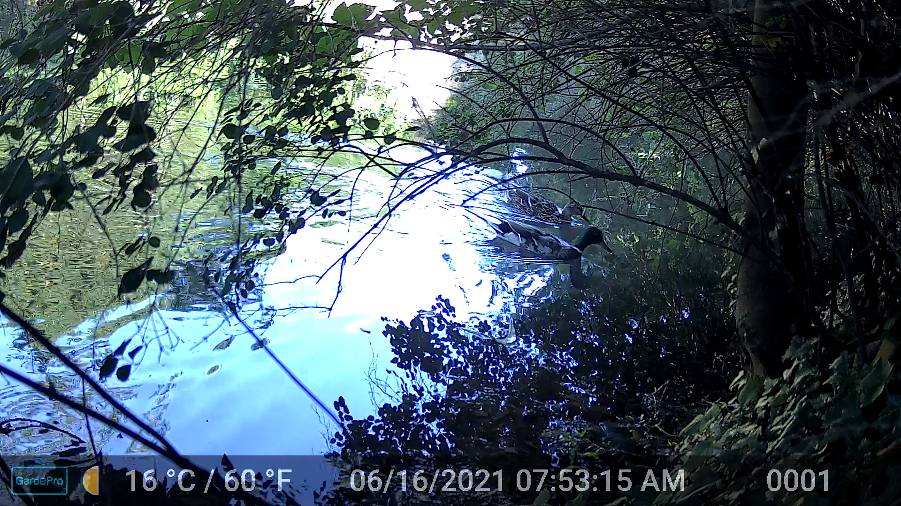
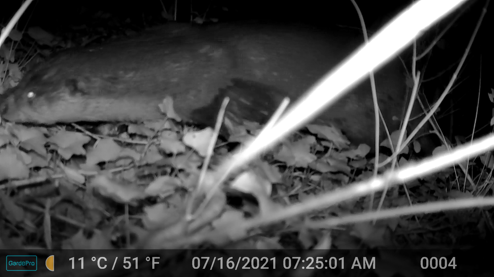
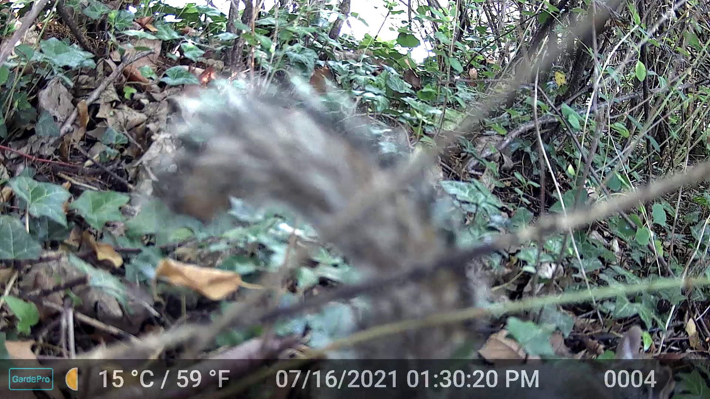
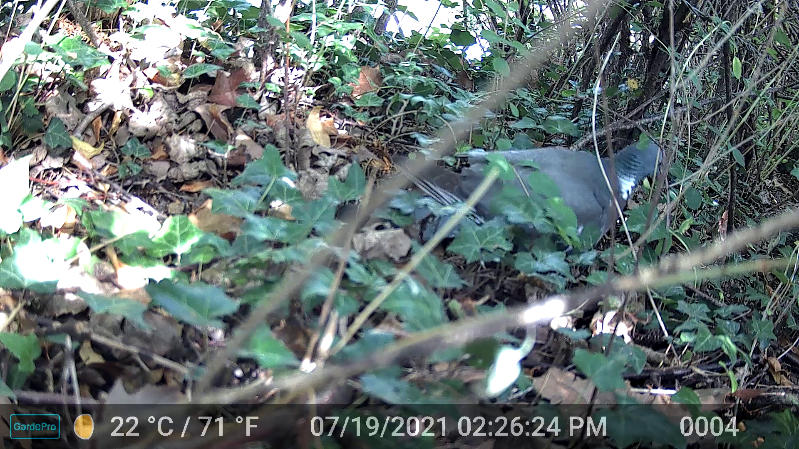
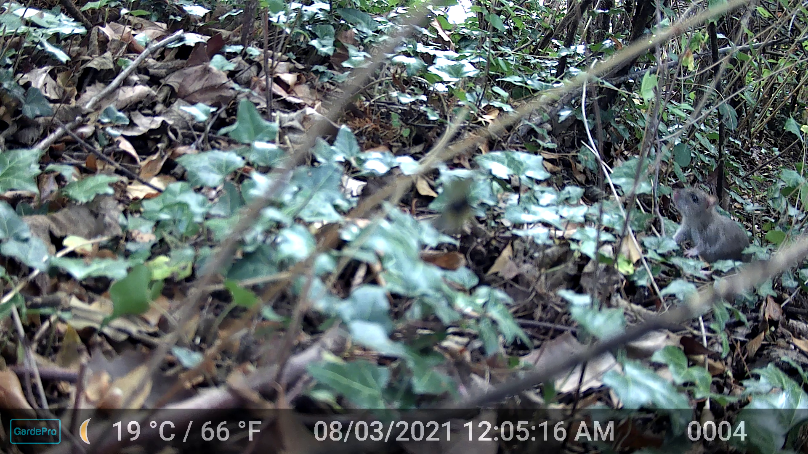

# DarWildClass

This project serves to classify animals detected through the wild cameras installed at Darwin College, Cambridge, UK.

Since we don't have labelled datasets from our cameras, we were hoping to just use already general-purpose pre-trained classification models.

The cameras only capture a video clip when they observe movement, hence identifying if there is an animal in the any given frame is not the main task/problem. As soon as movement is identified the camera records a 10s clip consisting of >300 frames.

Some issues identified:

- if camera points onto water, then there are clips that don't have animals in it, likely because the water movement triggered the camera
- locations where there is a stark contrast between sun and shade make it harder for the model to identify animals (or any objects)

## Environment

I'm using python, mainly with the `timm` package. Packages are installed in a conda environment `darwild`. All packages and versions can be found in this file: `darwild.yml` (`darwild_fromhistory.yml` for just the requested packages).

For the dashboard use the `darwild_dashboard.yml` and `darwild_dashboard_fromhistory.yml` files. And then run
```
conda activate darwild_dashboard
python dashboard.py
```

## Procedure

1. Get all frames in the 10s clip.
2. For each frame run the pre-trained `tf_efficientnet_b5.ns_jft_in1k` model from https://github.com/huggingface/pytorch-image-models (Artem's recommendation).
3. Get the top 5 predictions in each frame.
4. Count in how many frames each top 5 class was detected.

Ideas how to do better:

1. Create overlapping patches in each frame and run classification on patches (such that e.g. centre cropping on whole image, doesn't just crop out the animal); possible problem: a lot of patches might not contain any animal, depending where the animal passes it might fill the whole image, so cropping will actually cut it up (e.g. s. otter)
2. First use another model that identifies the animal in the picture and provides a bounding box which then can be used to crop the image and then pass it to the classifier.

## Testing

### `DSCF0935.MP4` - Ducks

There's two ducks (male and female) in the footage. However these are the classes the model finds:



```{python}
[{'label': 'lakeside, lakeshore', 'number of frames:': 307}, {'label': 'valley, vale', 'number of frames:': 263}, {'label': 'dam, dike, dyke', 'number of frames:': 159}, {'label': 'water_snake', 'number of frames:': 153}, {'label': 'canoe', 'number of frames:': 142}, {'label': 'beaver', 'number of frames:': 126}, {'label': 'cliff, drop, drop-off', 'number of frames:': 94}, {'label': 'drake', 'number of frames:': 71}, {'label': 'American_coot, marsh_hen, mud_hen, water_hen, Fulica_americana', 'number of frames:': 71}, {'label': 'goose', 'number of frames:': 70}, {'label': 'platypus, duckbill, duckbilled_platypus, duck-billed_platypus, Ornithorhynchus_anatinus', 'number of frames:': 39}, {'label': 'black_swan, Cygnus_atratus', 'number of frames:': 20}, {'label': 'alp', 'number of frames:': 10}, {'label': 'barracouta, snoek', 'number of frames:': 6}, {'label': 'tench, Tinca_tinca', 'number of frames:': 4}]
```

=> It identifies `drake` (male duck) in 71/307 frames. But there are several other animal classes it identfies more frequently.

### `DSCF0005.MP4` - Otter

There is a otter moving through the clip in the first 2 seconds. It's face is hardly visible.



```{python}
[{'label': 'badger', 'number of frames:': 306}, {'label': 'armadillo', 'number of frames:': 306}, {'label': 'grey_fox, gray_fox, Urocyon_cinereoargenteus', 'number of frames:': 304}, {'label': 'porcupine, hedgehog', 'number of frames:': 274}, {'label': 'skunk, polecat, wood_pussy', 'number of frames:': 273}, {'label': 'beaver', 'number of frames:': 25}, {'label': 'mink', 'number of frames:': 18}, {'label': 'wombat', 'number of frames:': 10}, {'label': 'wild_boar, boar, Sus_scrofa', 'number of frames:': 6}, {'label': 'otter', 'number of frames:': 2}, {'label': 'cougar, puma, catamount, mountain_lion, painter, panther, Felis_concolor', 'number of frames:': 2}, {'label': 'mongoose', 'number of frames:': 1}, {'label': 'weasel', 'number of frames:': 1}, {'label': 'jaguar, panther, Panthera_onca, Felis_onca', 'number of frames:': 1}, {'label': 'red_fox, Vulpes_vulpes', 'number of frames:': 1}]
```

=> The model finds related animals. Otter is found in only 2 frames.

### `DSCF0006.MP4` - Squirrel

The squirrel is moving at the bottom of the image and is never visible in full.



```{python}
[{'label': 'vine_snake', 'number of frames:': 280}, {'label': 'bolete', 'number of frames:': 260}, {'label': 'hen-of-the-woods, hen_of_the_woods, Polyporus_frondosus, Grifola_frondosa', 'number of frames:': 258}, {'label': 'mushroom', 'number of frames:': 243}, {'label': 'agaric', 'number of frames:': 170}, {'label': 'stinkhorn, carrion_fungus', 'number of frames:': 78}, {'label': 'badger', 'number of frames:': 32}, {'label': 'robin, American_robin, Turdus_migratorius', 'number of frames:': 30}, {'label': 'fox_squirrel, eastern_fox_squirrel, Sciurus_niger', 'number of frames:': 27}, {'label': 'armadillo', 'number of frames:': 25}, {'label': 'mongoose', 'number of frames:': 21}, {'label': 'capuchin, ringtail, Cebus_capucinus', 'number of frames:': 15}, {'label': 'indri, indris, Indri_indri, Indri_brevicaudatus', 'number of frames:': 15}, {'label': 'three-toed_sloth, ai, Bradypus_tridactylus', 'number of frames:': 15}, {'label': 'ruffed_grouse, partridge, Bonasa_umbellus', 'number of frames:': 13}, {'label': 'skunk, polecat, wood_pussy', 'number of frames:': 11}, {'label': 'grey_fox, gray_fox, Urocyon_cinereoargenteus', 'number of frames:': 10}, {'label': 'porcupine, hedgehog', 'number of frames:': 10}, {'label': 'macaque', 'number of frames:': 7}, {'label': 'mink', 'number of frames:': 7}, {'label': 'weasel', 'number of frames:': 3}, {'label': 'chimpanzee, chimp, Pan_troglodytes', 'number of frames:': 1}, {'label': 'gorilla, Gorilla_gorilla', 'number of frames:': 1}, {'label': 'wood_rabbit, cottontail, cottontail_rabbit', 'number of frames:': 1}, {'label': 'knot', 'number of frames:': 1}, {'label': 'jaguar, panther, Panthera_onca, Felis_onca', 'number of frames:': 1}]
```

=> The model finds related animals. Squirrel is found in only 27 frames. Not sure where the snake is supposed to be :p

### `DSCF0025.MP4` - Pigeon

The pigeon is very well visible in the last frames.



```{python}
[{'label': 'ruffed_grouse, partridge, Bonasa_umbellus', 'number of frames:': 272}, {'label': 'robin, American_robin, Turdus_migratorius', 'number of frames:': 241}, {'label': 'quail', 'number of frames:': 239}, {'label': 'partridge', 'number of frames:': 204}, {'label': 'water_ouzel, dipper', 'number of frames:': 199}, {'label': 'hen-of-the-woods, hen_of_the_woods, Polyporus_frondosus, Grifola_frondosa', 'number of frames:': 94}, {'label': 'bolete', 'number of frames:': 63}, {'label': 'mushroom', 'number of frames:': 48}, {'label': 'agaric', 'number of frames:': 33}, {'label': 'jay', 'number of frames:': 30}, {'label': 'junco, snowbird', 'number of frames:': 24}, {'label': 'vine_snake', 'number of frames:': 21}, {'label': 'stinkhorn, carrion_fungus', 'number of frames:': 14}, {'label': 'European_gallinule, Porphyrio_porphyrio', 'number of frames:': 12}, {'label': 'armadillo', 'number of frames:': 9}, {'label': 'black_grouse', 'number of frames:': 9}, {'label': 'magpie', 'number of frames:': 8}, {'label': 'plastic_bag', 'number of frames:': 5}, {'label': 'chickadee', 'number of frames:': 3}, {'label': 'ptarmigan', 'number of frames:': 2}, {'label': 'hatchet', 'number of frames:': 2}, {'label': 'cleaver, meat_cleaver, chopper', 'number of frames:': 2}, {'label': 'box_turtle, box_tortoise', 'number of frames:': 1}]
```

=> It at least understands that it's a bird, but can't find pigeon here.

### `DSCF0115.MP4` - Mouse

Mouse is on the right hand side of the image, quite mouse-like.



```
[{'label': 'vine_snake', 'number of frames:': 243}, {'label': 'hen-of-the-woods, hen_of_the_woods, Polyporus_frondosus, Grifola_frondosa', 'number of frames:': 240}, {'label': 'bolete', 'number of frames:': 222}, {'label': 'mushroom', 'number of frames:': 203}, {'label': 'ruffed_grouse, partridge, Bonasa_umbellus', 'number of frames:': 162}, {'label': 'mongoose', 'number of frames:': 83}, {'label': 'stinkhorn, carrion_fungus', 'number of frames:': 79}, {'label': 'fox_squirrel, eastern_fox_squirrel, Sciurus_niger', 'number of frames:': 70}, {'label': 'weasel', 'number of frames:': 69}, {'label': 'armadillo', 'number of frames:': 63}, {'label': 'mink', 'number of frames:': 38}, {'label': 'beaver', 'number of frames:': 11}, {'label': 'partridge', 'number of frames:': 9}, {'label': 'wood_rabbit, cottontail, cottontail_rabbit', 'number of frames:': 8}, {'label': 'indri, indris, Indri_indri, Indri_brevicaudatus', 'number of frames:': 8}, {'label': 'kit_fox, Vulpes_macrotis', 'number of frames:': 3}, {'label': 'mousetrap', 'number of frames:': 3}, {'label': 'garter_snake, grass_snake', 'number of frames:': 2}, {'label': 'polecat, fitch, foulmart, foumart, Mustela_putorius', 'number of frames:': 2}, {'label': 'macaque', 'number of frames:': 2}, {'label': 'quail', 'number of frames:': 2}, {'label': 'junco, snowbird', 'number of frames:': 2}, {'label': 'agaric', 'number of frames:': 1}, {'label': 'night_snake, Hypsiglena_torquata', 'number of frames:': 1}, {'label': 'water_snake', 'number of frames:': 1}, {'label': 'whiptail, whiptail_lizard', 'number of frames:': 1}, {'label': 'otter', 'number of frames:': 1}, {'label': 'water_ouzel, dipper', 'number of frames:': 1}]
```

=> It finds a mouse trap, but not a mouse :').